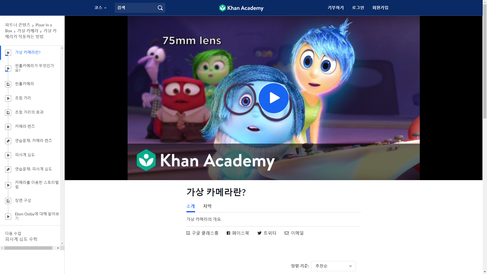
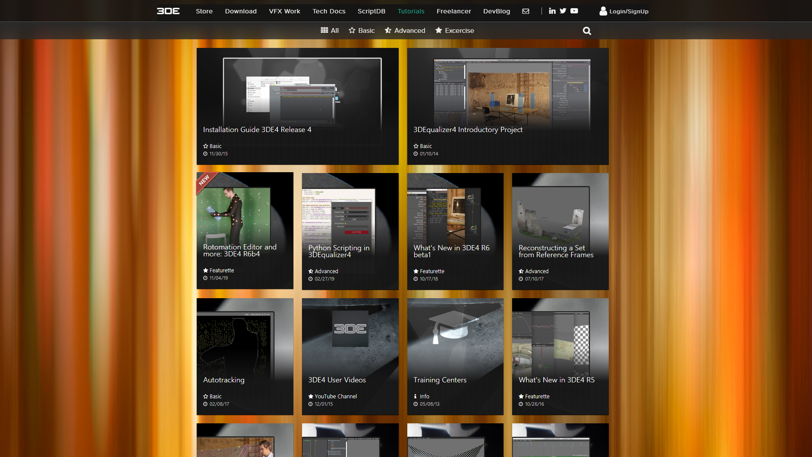

## mmlec
매치무브는 공부해야 될게 너무 많습니다. 마야, 매치무브 소프트웨어(3DEqualizer, PFTrack, Syntheyes 등), 온셋, 카메라 등 뭐하나 중요하지 않은게 없습니다. 그래서 공부하기 어렵게만 느껴집니다. 학생들한테만 어려운 게 아니라 실무자들도(매치무버도 포함;;) 매치무브 공부를 어디서 부터 어떻게 시작해야 될지 몰라서 포기하는 경우가 태반입니다.

매치무브를 처음 배우는 사람들이 가장 많이 저지르는 실수 중 하나는 "매치무브 소프트웨어" 부터 공부하는 것 입니다. 이것은 마치 사칙연산을 떼기도 전에 일차방정식을 공부하는 것과 같은 것입니다. 그래서 처음부터 어려움을 많이 느끼고 바로 좌절하게 됩니다.

매치무브를 장기적으로 그리고 효율적으로 공부하기 위해서 **필수 과목**과 **선택 과목**을 구분해야 합니다. mmlec은 이제 막 매치무브에 입문한 사람들이 필수로 배워야 하는 개념들을 정리한 리포지토리 입니다. 즉, **매치무브의 사칙연산**을 배울 수 있는 곳입니다.

## 목차
### [Orientaion - 매치무브?](doc/orientation.md)
### [Week1 - 카메라와 영상](doc/week1.md)
- 매치무브의 시작은 "촬영본(Live Action Footage)" 입니다. 애초에 **카메라가 촬영본을 어떻게 만들어 내는지** 부터 알아야 그 이후 매치무브 과정을 정확히 이해 할 수 있습니다.
- 카메라와 렌즈의 구조와 원리에 대해 학습합니다.
- 셔터 스피드 & 조리개 & ISO. 노출의 3요소에 대해 학습합니다.
- 포컬 랭스 & 필름 백 & 화각에 대해 학습합니다.
- 해상도, 픽셀, 종횡비, 프레임 레이트 등 영상에 관련된 용어들에 대해 학습합니다.
### [Week2 - 사진측량](doc/week2.md)
- **모든 매치무브 소프트웨어의 기본 원리**인 사진측량(Photogrammetry)에 대해서 학습합니다.
### [Week3 - 카메라 트래킹](doc/week3.md)
- 촬영본을 촬영할 당시 사용된 카메라의 궤적과 내부 파라미터들을 재건하는 카메라 트래킹 작업에 대해 학습합니다.
- 렌즈 디스토션 워크플로우(Lens Distortion Workflow)에 대해 학습합니다.
### [Week4 - 오브젝트 트래킹](doc/week4.md)
- 촬영본에 등장하는 오브젝트들의 궤적을 재건하는 오브젝트 트래킹 작업에 대해 학습합니다. 

---

## 수업 전에 보고오면 좋은 자료
### [Pixar in a Box - 가상 카메라가 작동하는 방법](https://ko.khanacademy.org/partner-content/pixar/virtual-cameras/virtual-cameras-1/v/virtual-cameras)
> 

---

## What's Next?
이제부턴 **선택 과목**들을 학습할 차례 입니다. 일단 필수 과목과 선택 과목의 가장 큰 차이점은 배우는 순서가 정해져 있지 않다는 겁니다. 작업을 하다가 막히는 부분들은 스스로 답을 찾아가면서 해결해야 하는 단계입니다.
### [3DEqualizer 공식 튜토리얼](https://www.3dequalizer.com/index.php?site=tutorials)
이퀄라이져 공식 홈페이지에는 양질의 튜토리얼 굉장히 많이 올라와 있습니다. 하지만 생각보다 어드벤스한 내용들이라 초보자가 처음부터 시청하기에는 다소 부담스러운 면이 있습니다. 이퀄라이져가 어느정도 익숙해진 뒤에 좀더 깊이 있게 공부하고 싶을때 시청하는 것을 추천드립니다.
> 
