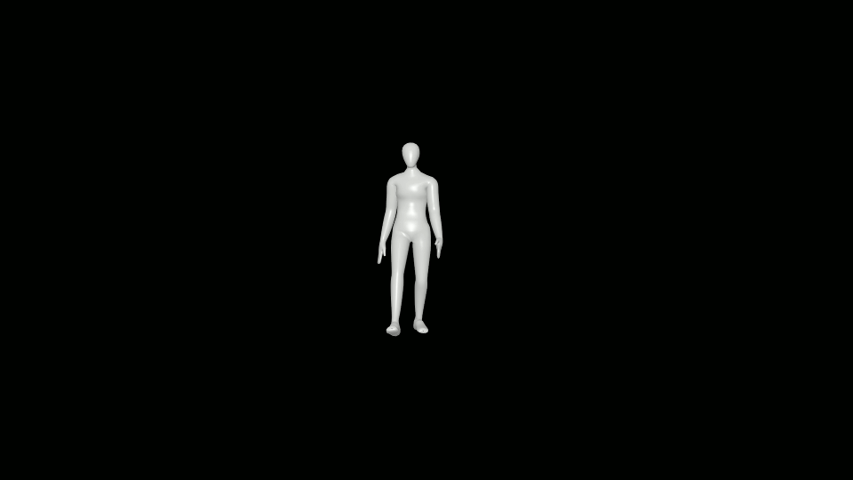
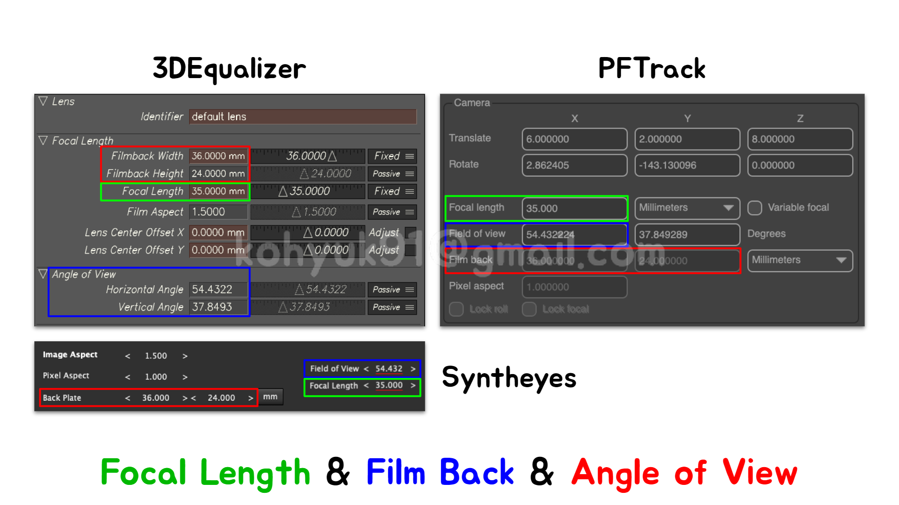

# Orientation
## 매치무브?
- 매치무브란, 촬영본의 이미지들을 사용하여 카메라와 오브젝트(또는 신체)가 씬 안에서 어떻게 움직이고 있는지 정밀하게 분석하는 작업을 말한다.
- 쉽게 말해 사진(2D) 또는 영상(2D)을 이용해서 3D 공간을 재건하는 작업이다.
 -이렇게 재건된 3D 공간에 우리는 CG요소(3D)들을 추가하고, 렌더링 이라는 작업을 거쳐서 CG이미지(2D)를 뽑아낸다. 합성툴에서 CG이미지(2D)와 촬영본(2D)을 합치면 우리가 흔히 보는 "실사합성" 최종영상이 만들어진다.
- 실사합성은 매치무브에서 시작된다!

## Scenario
>  
>  
>  
>  
>  
>  

## How
>  
>  
