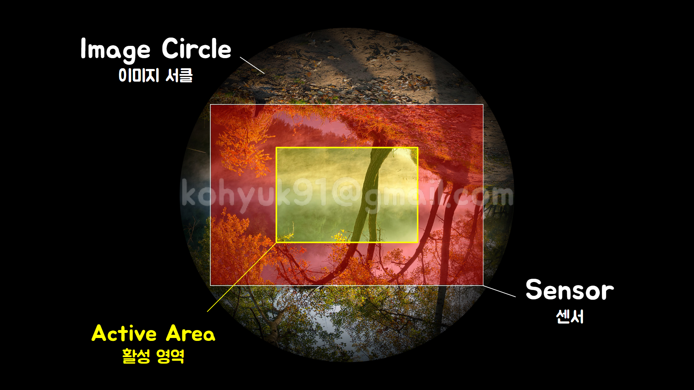
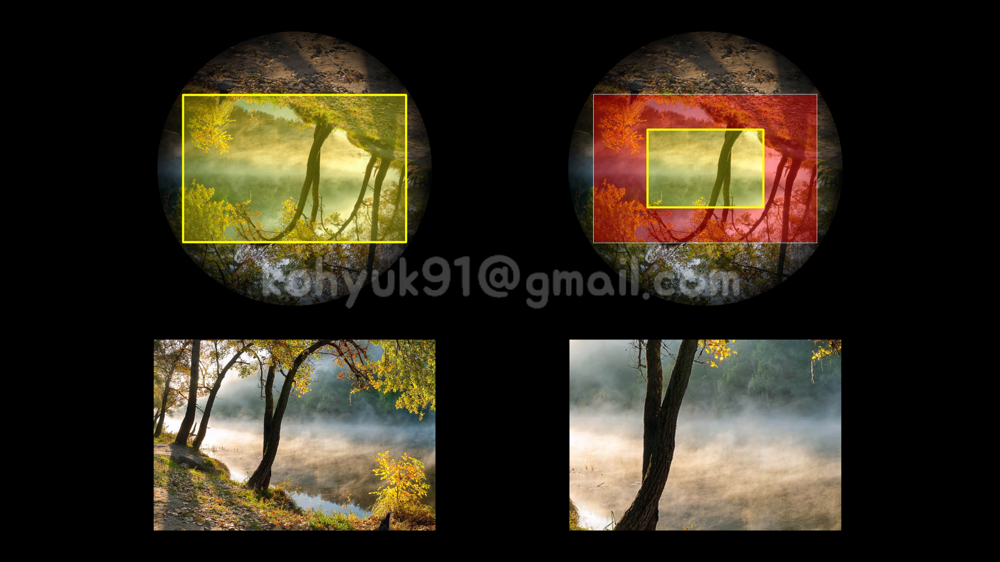
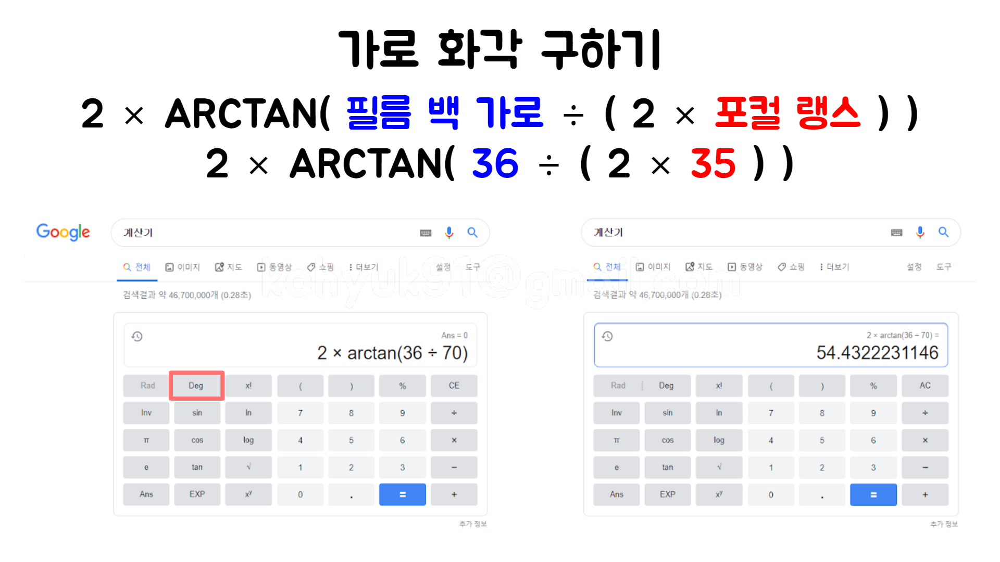

# 카메라와 영상

# 카메라

## 노출(Exposure)
### 셔터 스피드
- 정의: 이미지 센서 앞쪽의 셔터가 열려 있는 시간
- 노출과 관련된 특성: 셔터 스피드가 느려지면 사진이 밝아진다
- 고유의 특성: 셔터가 느려지면 사진이 흔들릴 수 있다
### 조리개
- 정의: 빛이 들어오는 **구멍의 크기**를 조절하여 빛의 양을 조절하는 장치
- 노출과 관련된 특성: 조리개를 조이면 사진이 어두워진다
- 고유의 특성: 조리개를 조이면 심도가 깊어진다
### ISO(감광속도)
- 정의: 렌즈를 통해 들어오는 광량을 카메라에서 **증폭**시키는 정도를 나타낸다
- 노출과 관련된 특성: ISO가 올라가면 사진이 밝아진다
- 고유의 특성: ISO가 올라가면 화질이 저하된다
    > 

## 화각(Angle of View)
### 포컬 랭스(Focal Length)
- 정의: 렌즈의 제 2주점에서 초점면까지의 거리
- 특징
    1. 포착할 수 있는 장면의 화각을 결정한다
        > 
    1. 렌즈에 의해 결정된다
        > <br>
        > 참고로 렌즈의 적혀있는 포컬 랭스 수치는 **대략값**입니다. 50mm 라고 적혀있다고 50.0mm로 딱 떨어지는 게 절대 아니라는 점.
### 필름 백(Film Back)
- 정의: 이미지 센서의 **활성 영역(Active Area)**.
    > <br>
    > **Film Back Size**와 **Active Area Size**는 같은 말<br>
    > **Film Back Size**와 **Sensor Size**는 전혀 다른 말!!!<br>
    > <br>
    > **활성 영역**은 **센서의 전체**가 될 수도 있고, **센서의 일부분**이 될 수도 있다.<br> 
- 특징
    1. 포착할 수 있는 장면의 화각을 결정한다
        > 
    1. 바디에 의해 결정된다
### 화각
- 특징
    1. **포컬 랭스와 필름 백의 조합**에 의해 결정된다
    1. 즉, **렌즈와 바디에 조합**에 의해 결정된다
- 계산법
    > <br>
    > 
- 예제
    > <br>
    > <br>
## 렌즈
### 구조
렌즈의 단면만 봐도 바로 느껴질 겁니다. ~~아 복잡한다.~~ 전문가가 아닌 이상 렌즈를 완벽하게 이해 할 필요가 없습니다. 경통 안에 왜 수많은 렌즈들이 들어가 있는지 그 이유 정도만 살펴보면 됩니다.
> 
### 볼록 렌즈
- 볼록 렌즈로 빛을 집중시킬 수 있다.
    > 
- 하지만 볼록 렌즈 한개 만으로는 한점에 집중시키기 힘듭니다.
    > 
### [광학 수차(Optical Abberation)](https://ko.wikipedia.org/wiki/%EA%B4%91%ED%95%99_%EC%88%98%EC%B0%A8)
#### 단색수차(Monochromatic Aberration)
1. 구면수차
1. 혜성형 수차
1. 비점수차
1. 상면만곡
1. :star:**왜곡(Distortion)**:star:
    - 다른 수차가 화상의 초점 선명도와 관계가 있지만, 왜곡은 화상의 전체적인 모양(Shape)과 관련이 있다.
    > <br>
    > Ashley Pomeroy at English Wikipedia [CC BY]

#### 색수차(Chromatic Aberration)
> <br>
> DrBob at the English language Wikipedia [CC BY-SA]
> <br>
### 교정
- **볼록 렌즈**와 **오목 렌즈**의 조합
    > <br>
    > Original uploaded by DrBob (Transfered by nbarth) [CC BY-SA]
### X군 Y매
- 볼록 렌즈 + 오목 렌즈 = 1군
- 렌즈 조각 = 1매
> 

---

# 영상
## 디지털 이미지

## 영상


## 파일 형식
### 이미지
- jpg / png / gif / dpx / exr 등
### 동영상
#### 이미지 시퀀스
- 낮장으로 이루어진 연속적인 이름을 가진 이미지 파일
- <이름(Name)>.<패딩(Padding)>.<확장자(Extension)>
- ```
  myvid.0001.jpg
  myvid.0002.jpg
  myvid.0003.jpg
  ...
  ```
- [DJV - 오픈소스 비디오 플레이어](https://darbyjohnston.github.io/DJV/)
#### 비디오 파일
- 이미지 시퀀스를 단일 파일로 압축한 것
- mp4 / mov / avi 등
---

# 참고자료 모음

## 기초
[](http://www.youtube.com/watch?v=AVWTiAN6J6Q "")
[](http://www.youtube.com/watch?v=-Y4YZlEQafs "")
[](http://www.youtube.com/watch?v=xgx8jMrGARg "")
[](http://www.youtube.com/watch?v=ZKmNUP_5TFQ "")

## 심화
[](http://www.youtube.com/watch?v=SxdpOwJCb4k "")
[](http://www.youtube.com/watch?v=NCDnwVecS6o "")
[](http://www.youtube.com/watch?v=IM_JA3yv5ek "")
[](http://www.youtube.com/watch?v=aDYDsCwbpDA "")
[](http://www.youtube.com/watch?v=fQCEgreQf2E "")

---

# Reference
1. [Derivative: nagualdesignOriginal: Balkhovitin [CC BY-SA 3.0 (https://creativecommons.org/licenses/by-sa/3.0)]](https://commons.wikimedia.org/wiki/File:Image_circle.jpg)
