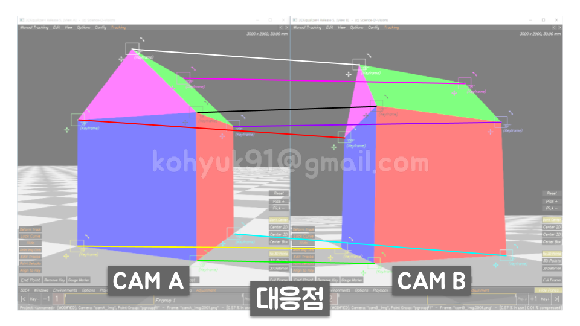

## 사진측량
- Photogrammetry(포토그래메트리)
- 사진들로부터 물체를 측정하는 작업

### Concept
> 

1. 물체의 높이와 폭을 알고싶다
    > 
1. 물체를 여러 각도에서 촬영한다
    > 
1. 촬영한 사진들을 수집한다
    > 
1. 사진들을 매치무브 소프트웨어에 넣고 계산한다
    > 
1. 물체의 높이와 폭을 알아냈다
    > 

### In Depth
> 

1. 촬영한 사진들을 수집한다
    > 
1. 각 카메라의 화각 정보를 입력한다 (포컬랭스 & 필름백 입력 >> 화각 자동산출)
    > 
1. 사진들간 대응점을 찾는다
    > 
1. 각 카메라의 화각과 대응점 정보를 솔버(solver)에 넣고 계산한다
    > 
1. 카메라 캘리브레이션 - 각 카메라의 위치와 회전이 재건
    > 
1. 삼각측량법 - 3D 포인트 재건
    >  
    >  
1. 물체의 높이와 폭을 알아냈다
    > 

### Condition
1. 최소 대응점 개수
    - 위치(Position) XYZ, 회전(Rotation) XYZ 6개의 값을 솔브하기 위해서, 프레임 마다 최소 6개의 대응점이 필요하다.
    - BAD
        > 
    - GOOD
        > 
1. 정적인 장면
    - 동적인 장면(Dynamic Scene)
        > 
        > 
1. 시차
    - Parallax(패럴랙스)
        > 
        > 
    - Translation
        >  
    - Rotation
        >  

## Photomodeling
1. 각 카메라 화각 구하기
    1. 필름 백 가로 또는 세로 구하기
        >  
        >  
        >  
        >  
    1. 포컬 랭스 구하기
        - 35mm
1. 씬의 스케일 및 로테이션(오리엔테이션) 규정
    1. 스케일 규정
        - 현장에서 측정해온 실측정보로 Distance Constraint 생성
        >  
    1. 로테이션(오리엔테이션) 규정
        - 가장 빠른 방법은 바닥점들을 무더기로 잡고 수평을 상태로 만들기.
        >  
- 화각이 같으면 솔브가 같다
    >  

## 심화

### A. 포컬 랭스를 모르면? (필름백은 알고 있다)
>  

1. 최저 에러
    - 수동
        >  
        >  
        >  
        >  
    - 자동
        >  
        >  
1. 소실점
    - fspy - [https://fspy.io/](https://fspy.io/)
        >  

### B. 필름 백을 모르면? (포컬랭스는 알고 있다)
- 녹화 해상도(원본 해상도)를 아는 상황
    - 제조사 홈페이지에 가서 역추적
        - [RED](https://www.red.com/crop-factor)
            >  
        - [ARRI](https://www.arri.com/en/learn-help/learn-help-camera-system/white-papers)
            >  
            >  
- 녹화 해상도(원본 해상도)를 모른는 상황
    - 최저 에러, 소실점 방법을 동원해서 필름 백 찾기.(비추천)
    - Go to C!!!

### C. 포컬 랭스 & 필름 백, 둘다 모른다
- 카메라 기종을 아는 상황
    1. 필름 백 가로를 센서의 가로 길이로 Fix.
    1. 최저 에러, 소실점 방법을 동원해서 포컬랭스 찾기.
- 카메라 기종을 모르는 상황
    1. 필름 백 가로를 36mm로 Fix.
    1. 최저 에러, 소실점 방법을 동원해서 포컬랭스 찾기.

---

### [PREV - Introduction to Matchmove](./week1.md) &nbsp;&nbsp;&nbsp;&nbsp;&nbsp;&nbsp;&nbsp;&nbsp;&nbsp;&nbsp;&nbsp;&nbsp;&nbsp;&nbsp;&nbsp;&nbsp;&nbsp;&nbsp;&nbsp;&nbsp;&nbsp;&nbsp;&nbsp;&nbsp; [NEXT - Camera Tracking](./week3.md)
