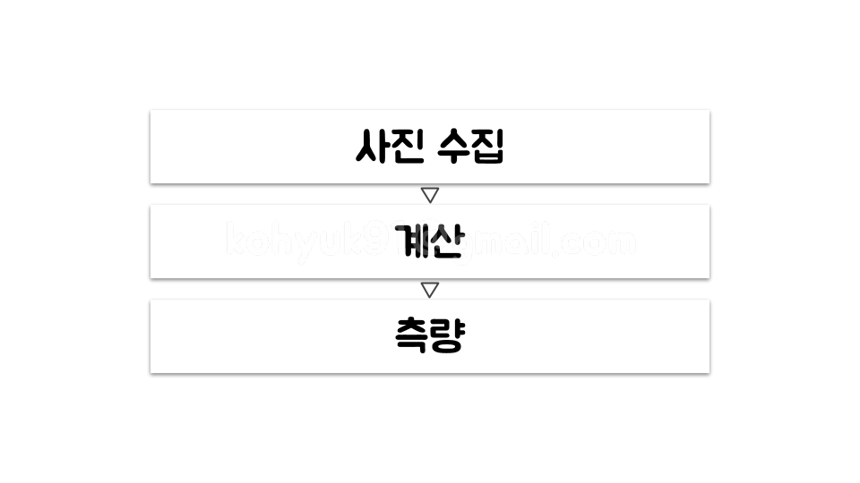
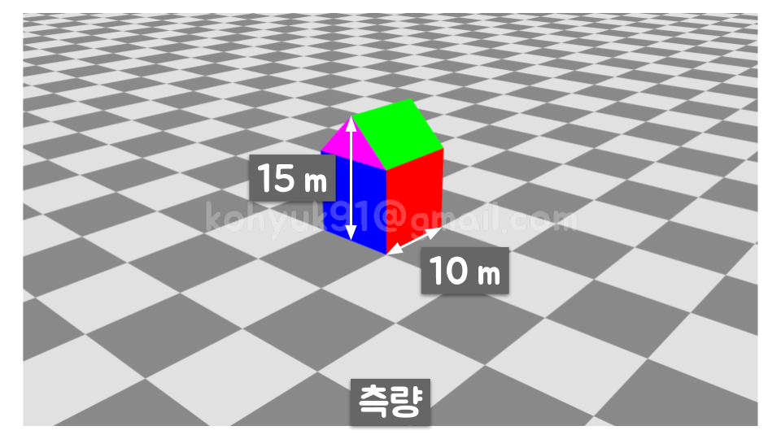
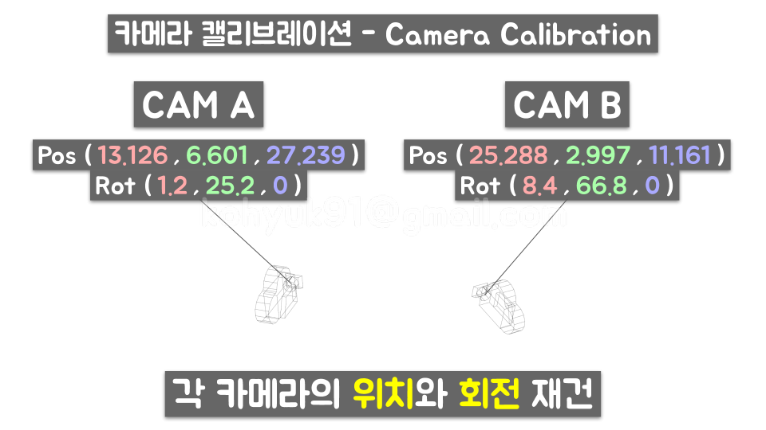

# Matchmove Software 101

## 사진측량
- Photogrammetry(포토그래메트리)
- 사진들로부터 물체를 측정하는 작업

### Concept
> 

1. 물체의 높이와 폭을 알고싶다
    > 
1. 물체를 여러 각도에서 촬영한다
    > 
1. 촬영한 사진들을 수집한다
    > 
1. 사진들을 매치무브 소프트웨어에 넣고 계산한다
    > 
1. 물체의 높이와 폭을 알아냈다
    > 

### In Depth
> 

1. 촬영한 사진들을 수집한다
    > 
1. 각 카메라의 화각 정보를 입력한다 (포컬랭스 & 필름백 입력 >> 화각 자동산출)
    > 
1. 사진들간 대응점을 찾는다
    > 
1. 각 카메라의 화각과 대응점 정보를 솔버(solver)에 넣고 계산한다
    > 
1. 카메라 캘리브레이션 - 각 카메라의 위치와 회전이 재건
    > 
1. 삼각측량법 - 3D 포인트 재건
    >  
    >  
1. 물체의 높이와 폭을 알아냈다
    > 

### Condition
1. 최소 대응점 개수
1. 정적인 장면
1. 시차
    - Parallax(패럴랙스)
    > 
    
## 심화

### 포컬 랭스를 모르면? (필름백은 알고 있다)

### 필름백을 모르면? (포컬랭스는 알고 있다)

### 둘다 모른다

---

### [PREV - Introduction to Matchmove](./week1.md) &nbsp;&nbsp;&nbsp;&nbsp;&nbsp;&nbsp;&nbsp;&nbsp;&nbsp;&nbsp;&nbsp;&nbsp;&nbsp;&nbsp;&nbsp;&nbsp; [NEXT - Camera Tracking](./week3.md)
