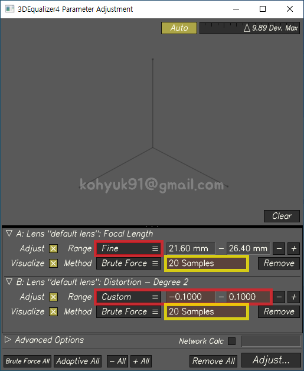
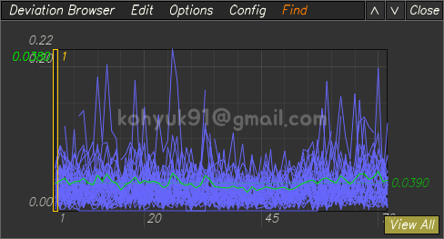
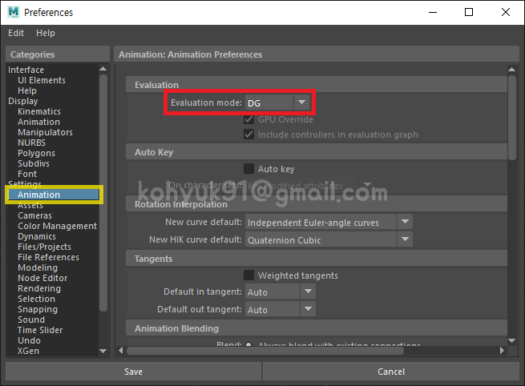

# Camera Tracking

## Camera Tracking in 3DEqualizer

### Install Scripts
1. Close 3DEqualizer
1. Download Scripts
    > 
    - [flip_tracking_direction.py](https://gist.github.com/kohyuk91/547c6325b559960702aa5499214d0003)
    - [easy_dewarp.py](https://gist.github.com/kohyuk91/9df1c8a6903931f2c8ab7cb6bd532d95)
1. Move Scripts to...
    - `path\to\3DE4_win64_r5\sys_data\py_scripts`
1. Start 3DEqualizer

### Import Live Action Footage
1. Browse
    > 
1. Export Buffer Compression File
    > 
### 2D Point Tracking
- 단축키
    - <kbd>Ctrl+LMB</kbd> - 포인트 생성
    - <kbd>T</kbd> - 지정된 방향으로 전부 트랙
    - <kbd><</kbd><kbd>></kbd> - 한프레임 뒤로/앞으로 트랙
    - <kbd>E</kbd> - Start/End
    - <kbd>R</kbd> - Flip Tracking Direction (스크립트 설치 필요, 단축키 설정 필요)
    - <kbd>←</kbd><kbd>→</kbd> - 한프레임 뒤로/앞으로 이동
    - <kbd>Page Down</kbd><kbd>Page Up</kbd> - 이전/다음 키프레임으로 이동
    - <kbd>Home</kbd><kbd>End</kbd> - 첫/마지막 프레임으로 이동
    - <kbd>Ctrl+R</kbd> - 키프레임 제거
    - <kbd>~</kbd> - 선택된 포인트 락(Lock) 걸기/풀기
    - Nudge Tool (숫자패드)
        > <kbd>7</kbd><kbd>8</kbd><kbd>9</kbd><br>
        > <kbd>4</kbd><kbd>5</kbd><kbd>6</kbd><br>
        > <kbd>1</kbd><kbd>2</kbd><kbd>3</kbd><br>
    - <kbd>I</kbd> - Image Controls ON/OFF
- Pattern & Search Box
    1. Pattern Box
    1. Search Box
- Point Attributes
    > <br>
    > Hide From Display Area - 포인트의 Visibility<br>
    > Direction - 트래킹이 진행되는 방향을 결정<br>
    > Rotate Reference Pattern - 레퍼런스 패턴의 로테이션 변화 감지<br>
    > Scale Reference Pattern - 레퍼런스 패턴의 스케일 변화 감지<br>
    > Calculation - 포인트가 솔브에 관여할지 결정<br>
- 좋은 & 나쁜 2D Track
    1. 좋은 2D Track
        - 수명이 길다
            - 프레임아웃 될 때까지 최대한 찍는다
            - 패턴이 사람이나 사물에 의해 가려져도 유추해서 최대한 찍는다
            - 사라졌다 다시 나타나는 패턴들을 꼼꼼히 다 찍어준다
        - 근경, 중경, 원경에 골고루 분포되어 있다
    1. 나쁜 2D Track
        - 수명이 짧다
        - 한곳에 몰려있다
        - 바들바들 거린다
        - 밀린다

### Solving
- Set Film Back & Focal Length
    - Camera: [Canon EOS 40D](https://ko.wikipedia.org/wiki/%EC%BA%90%EB%85%BC_EOS_40D)
    - Film Back: 22.20 X 14.8mm
    - Focal Length: 24mm
    > <br>
    > 메타데이터(Metadata)로도 확인 가능
- Calc >> Calc All From Scratch... <kbd>Alt+C</kbd>
    > <br>
    - Deviation Curve가 `W` 모양이다. 평균에러값도 `0.5281`로 높은편이다.
- 좋은 솔브
    1. Deviation Browser에서 Deviation Curve 모양이 일자 이면서 바닥과 평행하게 나온다
        - 모션블러가 심한 구간은 어쩔수 없이 스파이크(spike)가 생긴다
    1. Curve Editor에서 Rot/Pos XYZ가 노이즈 없이 스무스하게 나온다
    1. Lineup Controls(F5)에서 포인트를 잡고 Center3D 했을때 밀리지 않는다

### Focal Length & Lens Distortion & Parameter Adjustment
- Focal Length / 21mm ~ 30mm / 10 samples
    ```
    1. FL - 21mm >> Alt+C >> Deviation
    2. FL - 22mm >> Alt+C >> Deviation
    3. FL - 23mm >> Alt+C >> Deviation
    4. FL - 24mm >> Alt+C >> Deviation
    5. FL - 25mm >> Alt+C >> Deviation
    6. FL - 26mm >> Alt+C >> Deviation
    7. FL - 27mm >> Alt+C >> Deviation
    8. FL - 28mm >> Alt+C >> Deviation
    9. FL - 29mm >> Alt+C >> Deviation
    10. FL - 30mm >> Alt+C >> Deviation
    ```
- Distortion - Degree2 / 0.0000 ~ 0.0900 / 10 samples
    ```
    1. D2 - 0.0000 >> Alt+C >> Deviation
    2. D2 - 0.0100 >> Alt+C >> Deviation
    3. D2 - 0.0200 >> Alt+C >> Deviation
    4. D2 - 0.0300 >> Alt+C >> Deviation
    5. D2 - 0.0400 >> Alt+C >> Deviation
    6. D2 - 0.0500 >> Alt+C >> Deviation
    7. D2 - 0.0600 >> Alt+C >> Deviation
    8. D2 - 0.0700 >> Alt+C >> Deviation
    9. D2 - 0.0800 >> Alt+C >> Deviation
    10. D2 - 0.0900 >> Alt+C >> Deviation
    ```    
- 10 samples(FL) X 10 samples(D2) = 100 samples
    ```
    1. FL - 21mm & D2 - 0.0000 >> Alt+C >> Deviation
    2. FL - 22mm & D2 - 0.0000 >> Alt+C >> Deviation
    3. FL - 23mm & D2 - 0.0000 >> Alt+C >> Deviation
    4. FL - 24mm & D2 - 0.0000 >> Alt+C >> Deviation
    5. FL - 25mm & D2 - 0.0000 >> Alt+C >> Deviation
    6. FL - 26mm & D2 - 0.0000 >> Alt+C >> Deviation
    7. FL - 27mm & D2 - 0.0000 >> Alt+C >> Deviation
    8. FL - 28mm & D2 - 0.0000 >> Alt+C >> Deviation
    9. FL - 29mm & D2 - 0.0000 >> Alt+C >> Deviation
    10. FL - 30mm & D2 - 0.0000 >> Alt+C >> Deviation
    ---------------------------------------------
    11. FL - 21mm & D2 - 0.0100 >> Alt+C >> Deviation
    12. FL - 22mm & D2 - 0.0100 >> Alt+C >> Deviation
    13. FL - 23mm & D2 - 0.0100 >> Alt+C >> Deviation
    .
    .
    .
    98. FL - 28mm & D2 - 0.0900 >> Alt+C >> Deviation
    99. FL - 29mm & D2 - 0.0900 >> Alt+C >> Deviation
    100. FL - 30mm & D2 - 0.0900 >> Alt+C >> Deviation
    ```
- Adjust
    1. Start
        - Send to Parameter Adjustment Window
            > <br>
        - Adjust Focal Length & Distortion - Degree2
            > <br>
            > FL - Range <kbd>Fine</kbd> | Brute Force `20 Samples`<br>
            > D2 - Range <kbd>Custom</kbd> `-0.1000 ~ 0.1000` | Brute Force `20 Samples`<br>
        - Result
            > <br>
            > 평균에러값이 많이 낮아졌지만 아직도 스파이크(spike)가 존재한다<br>
    1. Fine Tune
        - Focal Length & Distortion - Degree2 & Quartic Distortion - Degree4
            > <br>
            > FL - Range <kbd>Fine</kbd> | Adaptive<br>
            > D2 - Range <kbd>Fine</kbd> | Adaptive<br>
            > D4 - Range <kbd>Fine</kbd> | Adaptive<br>    
        - Result
            > <br>
            > 평균에러값이 매우 낮아졌고, Deviation Curve 모양이 일자 이면서 바닥과 평행하다.<br>

### Orient Scene


### Export 3DE Project to Maya
1. Export Project
    - 3DE4 >> Export Project >>> Maya...
1. Export Undistorted Plates
    - 3DE4 >> Run Warp4...
    > <br>
    > Save Footage <kbd>V</kbd> - 체크시 지정된 경로로 이미지 저장<br>
    > Overscan <kbd>User-Defined</kbd> `2033` X `1353`
        > Overscan Value: `1.05`<br>
        > 1936 X 1.05 = 2032.8 >>올림>> 2033<br>
        > 1288 X 1.05 = 1352.4 >>올림>> 1353<br>

## Camera Tracking in Maya
### Install Shelf
1. Close Maya
1. Download Shelf
    - [shelf_Matchmove.mel](https://gist.github.com/kohyuk91/7edce53bc0c5dfa7a38c775e2edbd51e)
1. Move Shelf to...
    - `C:\Users\<USER>\Documents\maya\<VERSION>\prefs\shelves`
1. Start Maya
    > <br>
### Preference
- Evaluation Mode
    - Windows >> Settings/Preferences >> Preferences
    - Maya2017 이하 버젼에서는 Evaluation Mode가 DG로 설정되어 있지 않으면 이미지플랜 관련 버그가 발생함
    > <br>
    > Evaluation Mode <kbd>DG</kbd><br>
- Playback
    - Windows >> Settings/Preferences >> Preferences
    - 이미지 시퀀스를 올바르게 재생하기 위한 셋팅
    > 
    
### 3DE 프로젝트 임포트 (Import 3DE Project)
- 뷰포트(viewport)에 멜스크립트(MEL Script)를 드래그 앤 드롭

### 오버스캔 상쇄 (Compensate for Overscan)


### Modeling Set Geometry
- Holdout
- Point Triangulation

### Preview
- Playblast
    - Windows >> Playblast(Option Box)
    > <br>
    > Render offscreen <kbd>V</kbd> - 조금더 빠르게 Playblast를 뽑는다<br>
    > Format <kbd>image</kbd> - Playblast를 이미지 시퀀스로 뽑는다<br>
    > Encoding <kbd>jpg</kbd> - 가장 무난한 확장자<br>
    > Display size <kbd>From Render Settings</kbd> - Render Settings의 Width & Height값 사용<br>
    > Scale <kbd>1.00</kbd> - Playblast를 풀스케일로 뽑는다<br>
    > Movie file <kbd>경로</kbd> - 지정된 경로에 Playblast가 저장된다

### Publish
- Outliner Cleanup

## Lens Distortion Workflow

### 렌즈 왜곡(Lens Distortion)
- 간단히 말하면 상이 휘어 보이는 현상. [광학 수차](https://ko.wikipedia.org/wiki/%EA%B4%91%ED%95%99_%EC%88%98%EC%B0%A8) 중 하나.
> <br>
> [By Ashley Pomeroy at English Wikipedia, CC BY 3.0](https://commons.wikimedia.org/w/index.php?curid=71932741)

### Problem
- 렌즈왜곡을 보정하지 않으면 솔브가 제대로 되지않는다.
- 참고로 모든 렌즈에는 왜곡이 존재한다. 많고 적음의 차이지 없을 순 없다. 왜곡이 별로 없으면 그냥 무시하고 솔브하기도 한다.

### Lens Distortion Workflow

1. Work with "Distorted(Original)" plate in 3DEqualizer
    - ex) 1920 x 1080
1. Export "Undistorted" plate from 3DEqualizer
    - ex) 2112 x 1188 (Overscan Value 1.1)
1. Work with "Undistorted" plate in Maya

1. Render Image Resolution "Undistorted" plate Width & Height

1. Redistort Render Image in Nuke
    - ex) 2112 x 1188 to 1920 x 1080
1. Merge Render Image with "Distorted(Original)" plate
