# Camera Tracking

## Camera Tracking in 3DEqualizer

### Install Scripts
1. Close 3DEqualizer
1. Download Scripts
    > 
    - [flip_tracking_direction.py](https://gist.github.com/kohyuk91/547c6325b559960702aa5499214d0003)
    - [easy_dewarp.py](https://gist.github.com/kohyuk91/9df1c8a6903931f2c8ab7cb6bd532d95)
    - [align_XZ_flip.py](https://gist.github.com/kohyuk91/bf59ddcf8e60f50c3c030895a5d84d24)
    - [Export_NukeX_LensDistortion_Node.py](https://gist.github.com/kohyuk91/45e941a7cd070e7aae57065948adb7f8)
1. Move Scripts to...
    - `path\to\3DE4_win64_r5\sys_data\py_scripts`
1. Start 3DEqualizer

### Set Environment
> 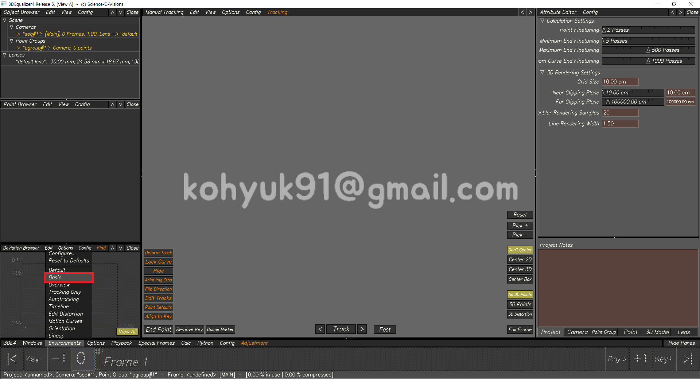

### Import Sequence
1. Browse
    > <br>
    > <br>
    > Image courtesy of [Science-D-Visions](http://www.sci-d-vis.com/)<br>
1. Export Buffer Compression File
    > 
### 2D Point Tracking
- 단축키
    - <kbd>Ctrl+LMB</kbd> - 포인트 생성
    - <kbd>T</kbd> - 지정된 방향으로 전부 트랙
    - <kbd><</kbd><kbd>></kbd> - 한프레임 뒤로/앞으로 트랙
    - <kbd>E</kbd> - Start/End
    - <kbd>R</kbd> - Flip Tracking Direction (스크립트 설치 필요, 단축키 설정 필요)
    - <kbd>←</kbd><kbd>→</kbd> - 한프레임 뒤로/앞으로 이동
    - <kbd>Page Down</kbd><kbd>Page Up</kbd> - 이전/다음 키프레임으로 이동
    - <kbd>Home</kbd><kbd>End</kbd> - 첫/마지막 프레임으로 이동
    - <kbd>Ctrl+R</kbd> - 키프레임 제거
    - <kbd>~</kbd> - 선택된 포인트 락(Lock) 걸기/풀기
    - Nudge Tool (숫자패드)
        > <kbd>7</kbd><kbd>8</kbd><kbd>9</kbd><br>
        > <kbd>4</kbd><kbd>5</kbd><kbd>6</kbd><br>
        > <kbd>1</kbd><kbd>2</kbd><kbd>3</kbd><br>
    - <kbd>I</kbd> - Image Controls ON/OFF
- Pattern & Search Box
    1. Pattern Box
    1. Search Box
- Point Attributes
    > <br>
    > Hide From Display Area - 포인트의 Visibility<br>
    > Direction - 트래킹이 진행되는 방향을 결정<br>
    > Rotate Reference Pattern - 레퍼런스 패턴의 로테이션 변화 감지<br>
    > Scale Reference Pattern - 레퍼런스 패턴의 스케일 변화 감지<br>
    > Calculation - 포인트가 솔브에 관여할지 결정<br>
- 좋은 & 나쁜 2D Track
    1. 좋은 2D Track
        - 수명이 길다
            - 프레임아웃 될 때까지 최대한 찍는다
            - 사라졌다 다시 나타나는 패턴들을 꼼꼼히 다 찍어준다
            - 패턴이 사람이나 사물에 의해 가려져도 유추해서 최대한 찍는다(정말 찍을게 없을 때...)
        - 근경, 중경, 원경에 골고루 분포되어 있다
    1. 나쁜 2D Track
        - 수명이 짧다
        - 한곳에 몰려있다
        - 바들바들 거린다
        - 밀린다

### Solving
- Set Film Back & Focal Length
    - Camera: [Canon EOS 40D](https://ko.wikipedia.org/wiki/%EC%BA%90%EB%85%BC_EOS_40D)
    - Film Back: 22.20 X 14.8mm
    - Focal Length: 24mm
    > 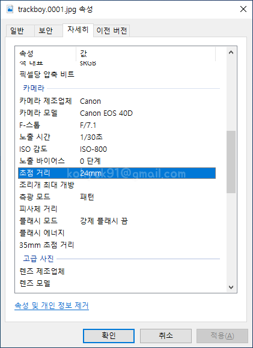<br>
    > 메타데이터(Metadata)
- Calc >> Calc All From Scratch... <kbd>Alt+C</kbd>
    > <br>
    - Deviation Curve가 `W` 모양이다. 평균에러값도 `0.5281`로 높은편이다.
- 좋은 솔브
    1. Deviation Browser에서 Deviation Curve 모양이 일자 이면서 바닥과 평행하게 나온다
        - 모션블러가 심한 구간은 어쩔수 없이 스파이크(spike)가 생긴다
    1. Curve Editor에서 Rot/Pos XYZ가 노이즈 없이 스무스하게 나온다
    1. Lineup Controls(F5)에서 포인트를 잡고 Center3D 했을때 밀리지 않는다

### Focal Length & Lens Distortion & Parameter Adjustment
- Focal Length / 21mm ~ 30mm / 10 samples
    ```
    1. FL - 21mm >> Alt+C >> Deviation
    2. FL - 22mm >> Alt+C >> Deviation
    3. FL - 23mm >> Alt+C >> Deviation
    4. FL - 24mm >> Alt+C >> Deviation
    5. FL - 25mm >> Alt+C >> Deviation
    6. FL - 26mm >> Alt+C >> Deviation
    7. FL - 27mm >> Alt+C >> Deviation
    8. FL - 28mm >> Alt+C >> Deviation
    9. FL - 29mm >> Alt+C >> Deviation
    10. FL - 30mm >> Alt+C >> Deviation
    ```
- Distortion - Degree2 / 0.0000 ~ 0.0900 / 10 samples
    ```
    1. D2 - 0.0000 >> Alt+C >> Deviation
    2. D2 - 0.0100 >> Alt+C >> Deviation
    3. D2 - 0.0200 >> Alt+C >> Deviation
    4. D2 - 0.0300 >> Alt+C >> Deviation
    5. D2 - 0.0400 >> Alt+C >> Deviation
    6. D2 - 0.0500 >> Alt+C >> Deviation
    7. D2 - 0.0600 >> Alt+C >> Deviation
    8. D2 - 0.0700 >> Alt+C >> Deviation
    9. D2 - 0.0800 >> Alt+C >> Deviation
    10. D2 - 0.0900 >> Alt+C >> Deviation
    ```    
- 10 samples(FL) × 10 samples(D2) = 100 samples
    ```
    1. FL - 21mm & D2 - 0.0000 >> Alt+C >> Deviation
    2. FL - 22mm & D2 - 0.0000 >> Alt+C >> Deviation
    3. FL - 23mm & D2 - 0.0000 >> Alt+C >> Deviation
    4. FL - 24mm & D2 - 0.0000 >> Alt+C >> Deviation
    5. FL - 25mm & D2 - 0.0000 >> Alt+C >> Deviation
    6. FL - 26mm & D2 - 0.0000 >> Alt+C >> Deviation
    7. FL - 27mm & D2 - 0.0000 >> Alt+C >> Deviation
    8. FL - 28mm & D2 - 0.0000 >> Alt+C >> Deviation
    9. FL - 29mm & D2 - 0.0000 >> Alt+C >> Deviation
    10. FL - 30mm & D2 - 0.0000 >> Alt+C >> Deviation
    ---------------------------------------------
    11. FL - 21mm & D2 - 0.0100 >> Alt+C >> Deviation
    12. FL - 22mm & D2 - 0.0100 >> Alt+C >> Deviation
    13. FL - 23mm & D2 - 0.0100 >> Alt+C >> Deviation
    .
    .
    .
    98. FL - 28mm & D2 - 0.0900 >> Alt+C >> Deviation
    99. FL - 29mm & D2 - 0.0900 >> Alt+C >> Deviation
    100. FL - 30mm & D2 - 0.0900 >> Alt+C >> Deviation
    ```
- Adjust
    1. Start
        - Send to Parameter Adjustment Window
            > 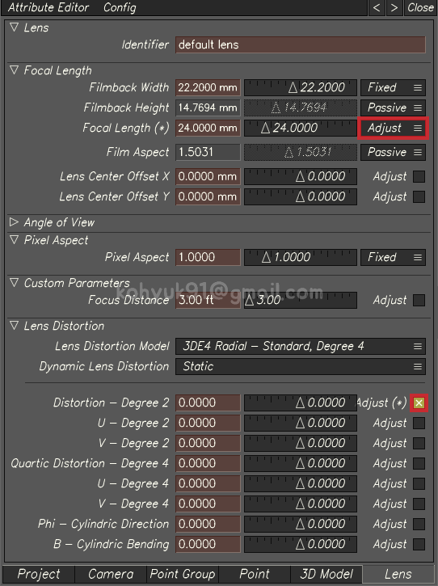<br>
        - Adjust Focal Length & Distortion - Degree2
            > Windows >> Parameter Adjustment Window <kbd>Alt+6</kbd><br>
            > <br>
            > FL - Range <kbd>Fine</kbd> | Brute Force `20 Samples`<br>
            > D2 - Range <kbd>Custom</kbd> `-0.1000 ~ 0.1000` | Brute Force `20 Samples`<br>
        - Result
            > <br>
            > 평균에러값이 많이 낮아졌지만 아직도 스파이크(spike)가 존재한다<br>
    1. Fine Tune
        - Focal Length & Distortion - Degree2 & Quartic Distortion - Degree4
            > <br>
            > FL - Range <kbd>Fine</kbd> | Adaptive<br>
            > D2 - Range <kbd>Fine</kbd> | Adaptive<br>
            > D4 - Range <kbd>Fine</kbd> | Adaptive<br>    
        - Result
            > <br>
            > 평균에러값이 매우 낮아졌고, Deviation Curve 모양이 일자 이면서 바닥과 평행하다.<br>

### Orient Scene
1. Align Multiple Points to XZ Plane
    1. 그라운드 포인트(Ground Point)들 선택
        > 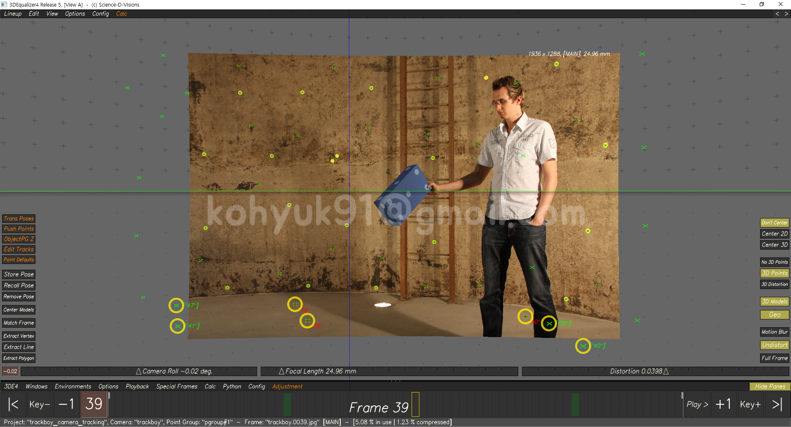<br>
    1. 3D Orientation Controls<kbd>F6</kbd> >> Edit >> Align Multiple Points >> XZ Plane
        > 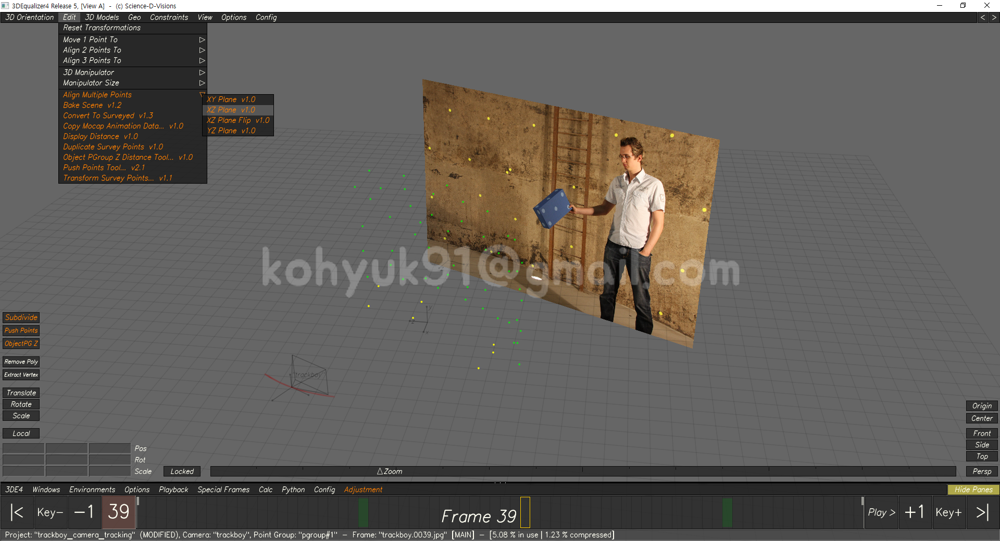<br>
    - 씬이 거꾸로 뒤집히는 현상이 간헐적으로 발생하는데, 그럴땐 `XZ Plane`대신 `XZ Plane Flip`
        > 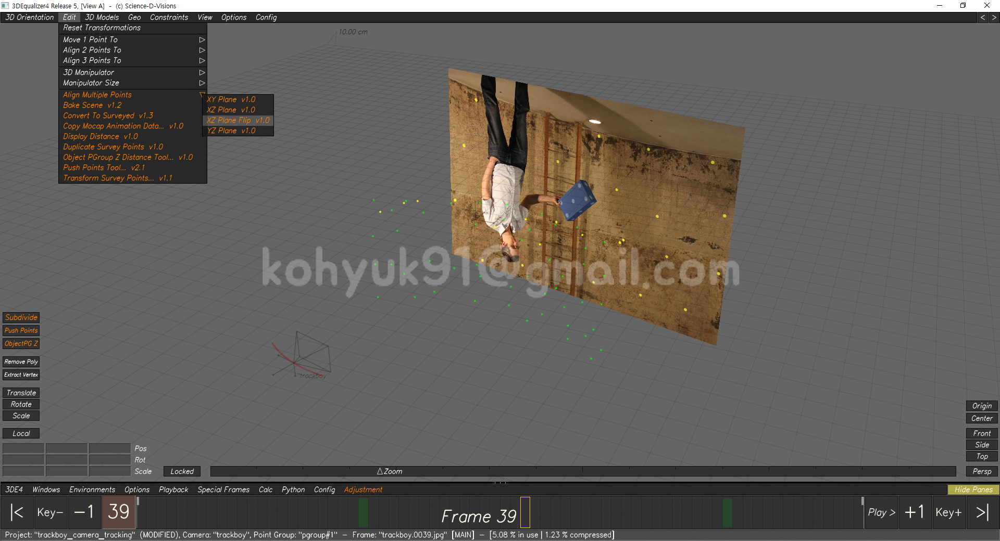<br>
1. Move 1 Point to Origin
    1. Origin으로 보낼 포인트 하나 선택
    1. 3D Orientation Controls<kbd>F6</kbd> >> Edit >> Move 1 Point To >> Origin
        > 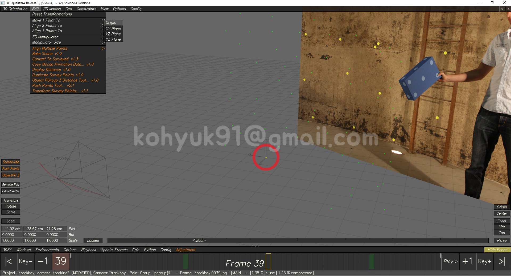<br>

### Scale Scene
- 3DEqualizer에서 Distance Constraint를 통해 씬스케일 조정 할 수 있으나, 이번 시간에는 Maya에서...
- 남자의 키가 180cm 라고 가정하고 씬스케일을 맞출 것이다. 따라서 남자가 서 있는 (대략적인)위치가 필요하다.
- 남자가 서 있는 위치를 Triangulate Points를 사용해서 알아낸다.
    > <br>
### Export 3DE Project to Maya
1. Export Project
    - 3DE4 >> Export Project >>> Maya...
        > 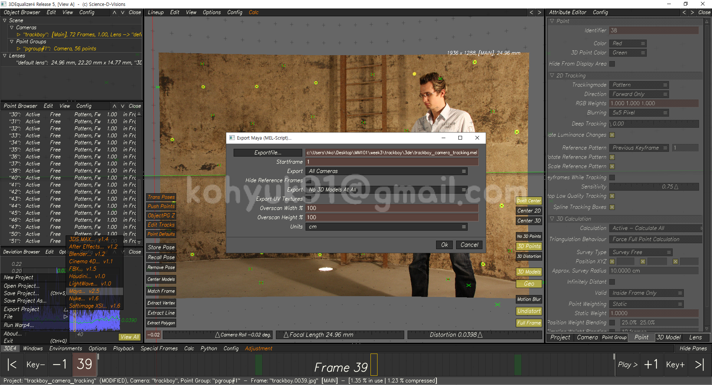<br>
        > Exportfile... - 파일 저장 경로<br>
1. Export Undistorted Plates
    1. 3DE4 >> Run Warp4...
        > 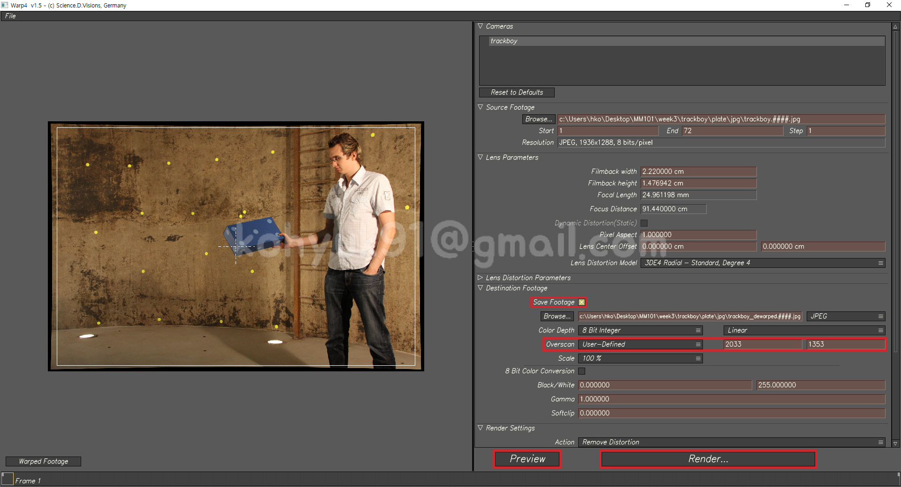<br>
        > Save Footage <kbd>V</kbd> - 체크시 지정된 경로로 이미지 저장<br>
        > Overscan <kbd>User-Defined</kbd> | 2033 X 1353<br>
        > `Overscan Value: 1.05`<br>
        > `1936 × 1.05 = 2032.8 >>올림>> 2033`<br>
        > `1288 × 1.05 = 1352.4 >>올림>> 1353`<br>
        > Preview - Undistort Plate 뽑았을때 잘리는 픽셀이 있는지 확인<br>
        > Render... - 버튼을 누르면 지정된 경로에 Undistort Plate가 저장된다<br>
    1. Python >> Easy Dewarp...
        > <br>
        > <kbd>+0.05</kbd> 클릭해서 Overscan Value를 `1.05`로 만든다<br>
        > (Bounding Box 글씨가 초록색으로 변하면, Undistort Plate 뽑았을때 잘리는 픽셀이 없다는 뜻)<br>
        > <kbd>Ok</kbd>를 누르면 지정된 경로에 Undistort Plate가 저장된다<br>
## Camera Tracking in Maya
### Install Shelf
1. Close Maya
1. Download Shelf
    - [shelf_Matchmove.mel](https://gist.github.com/kohyuk91/7edce53bc0c5dfa7a38c775e2edbd51e)
1. Move Shelf to...
    - `C:\Users\<USER>\Documents\maya\<VERSION>\prefs\shelves`
1. Start Maya
    > <br>
### Preference
- Evaluation Mode
    - Windows >> Settings/Preferences >> Preferences
    - Maya2017 이하 버젼에서는 Evaluation Mode가 DG로 설정되어 있지 않으면 이미지플랜 관련 버그가 발생함
    > <br>
    > Evaluation Mode <kbd>DG</kbd><br>
- Playback
    - Windows >> Settings/Preferences >> Preferences
    - 이미지 시퀀스를 올바르게 재생하기 위한 셋팅
    > 
    
### 3DE 프로젝트 임포트 (Import 3DE Project)
- 뷰포트(viewport)에 멜스크립트(MEL Script)를 드래그 앤 드롭
    > 

### 오버스캔 상쇄 (Compensate for Overscan)
- 3D포인트(로케이터)가 이퀄라이져 뷰포트와 다르게 위치해 있다. 이런 현상이 나타나는 이유는 우리가 강제로 이미지 사이즈를 키우면서 화각도 같이 키웠기 때문이다. 카메라의 화각은 그대로인데 이미지의 화각만 넓어졌으니 이런 문제가 생긴것이다. 필름백 가로 길이와 세로 길이를 조절하여 오버스캔을 상쇄한다. (포컬랭스로 화각을 조정하지 않는 이유는 가로와 세로 화각이 커진 스케일 다를 수 있기 때문)
1. 이미지플랜을 Undistort Plate로 교체한다
    > 
1. Get Scale
    - Undistort Plate Width ÷ Original Plate Width = `Width Scale`
        - 2033 ÷ 1936 = 1.0501033058
    - Undistort Plate Height ÷ Original Plate Height = `Height Scale`
        - 1353 ÷ 1288 = 1.0504658385
1. Change Film Back
    > 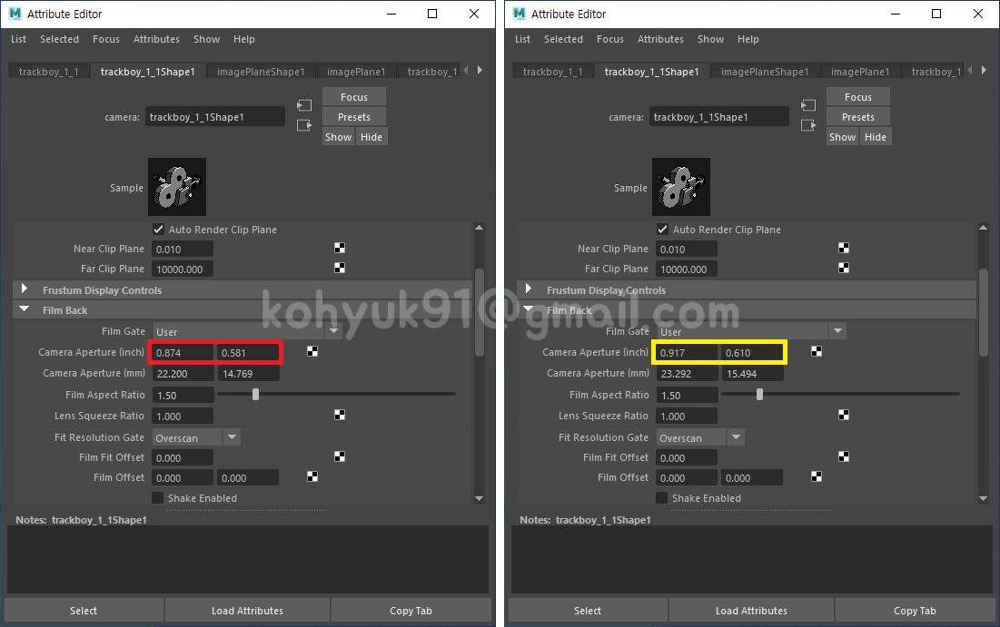
    - Camera Aperture Width(inch) × `Width Scale` = `Compensated Aperture Width`
        - 0.874 × 1.0501033058 = 0.917
    - Camera Aperture Height(inch) × `Height Scale` = `Compensated Aperture Height`
        - 0.581 × 1.0504658385 = 0.610
1. Change Image Plane Size
    > 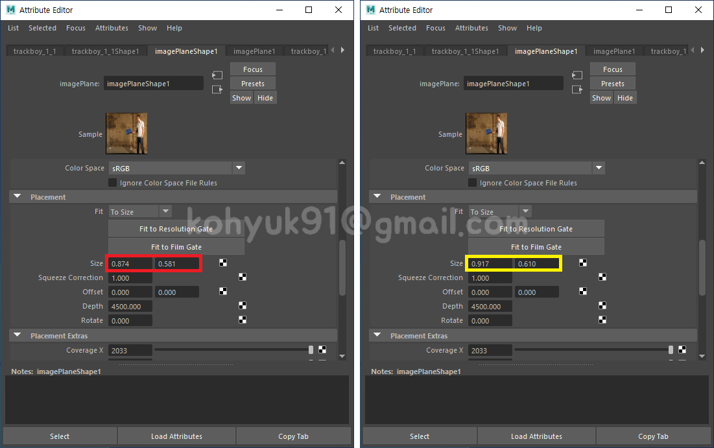
    - SizeX = `Compensated Aperture Width` = 0.917
    - SizeY = `Compensated Aperture Height` = 0.610
1. Corrected
    > 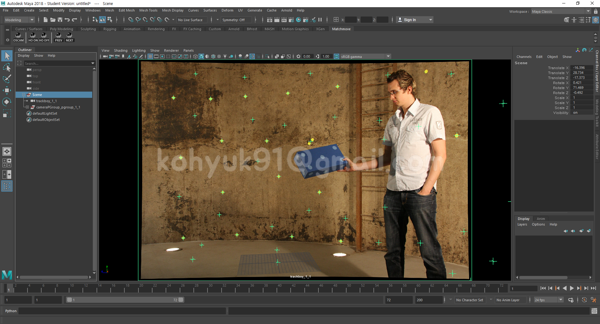
- Overscan 스크립트
    1. 이미지플랜을 Undistort Plate로 교체한다
    1. Overscan 스크립트 실행
        > 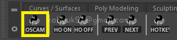
    1. 아웃라이너(Outliner)에서 카메라 선택하고 <kbd>Get</kbd> 버튼 클릭
        > 
    1. Original Plate Resolution 입력
        > 
    1. <kbd>Overscan</kbd> 버튼 클릭
    
### Modeling Set Geometry
- 바닥 & 벽 모델링
    > <br>
    > <br>

### Scale Scene
1. `mmlec/week3/asset/man_180cm.obj` 임포트
    > 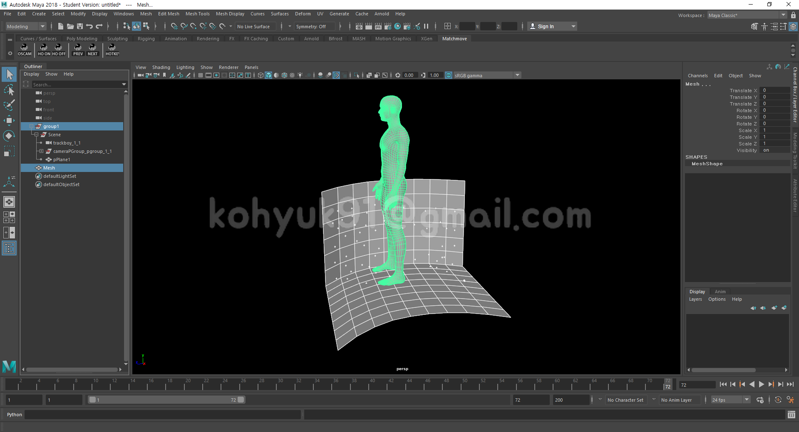<br>
1. 남자 오브젝트를 제외한 모든 오브젝트를 그룹지어서 스케일 조정한다
    > <br>
    > <br>
### Preview
- Playblast
    - Windows >> Playblast(Option Box)
    > <br>
    > Render offscreen <kbd>V</kbd> - 조금더 빠르게 Playblast를 뽑는다<br>
    > Format <kbd>image</kbd> - Playblast를 이미지 시퀀스로 뽑는다<br>
    > Encoding <kbd>jpg</kbd> - 가장 무난한 확장자<br>
    > Display size <kbd>From Render Settings</kbd> - Render Settings의 Width & Height값 사용<br>
    > Scale <kbd>1.00</kbd> - Playblast를 풀스케일로 뽑는다<br>
    > Movie file <kbd>경로</kbd> - 지정된 경로에 Playblast가 저장된다

### Publish
- Outliner Cleanup
   1. Bake Camera

## Lens Distortion Workflow

### 렌즈 왜곡(Lens Distortion)
- 간단히 말하면 상이 휘어 보이는 현상. [광학 수차](https://ko.wikipedia.org/wiki/%EA%B4%91%ED%95%99_%EC%88%98%EC%B0%A8) 중 하나.
> <br>
> [By Ashley Pomeroy at English Wikipedia, CC BY 3.0](https://commons.wikimedia.org/w/index.php?curid=71932741)

### Problem
- 렌즈왜곡을 보정하지 않으면 솔브가 제대로 되지않는다.
- 참고로 모든 렌즈에는 왜곡이 존재한다. 많고 적음의 차이지 없을 순 없다. 왜곡이 별로 없으면 그냥 무시하고 솔브하기도 한다.

### Lens Distortion Workflow

1. Work with "Distorted(Original)" plate in 3DEqualizer
    - 1936 x 1288
    > <br>
1. Export "Undistorted" plate from 3DEqualizer
    - 2033 x 1353 (Overscan Value 1.05)
    > <br>
1. Work with "Undistorted" plate in Maya
    - Add 3D Asset(Cones)
    > <br>
1. !!!! Render Image Resolution is "Undistorted" plate Resolution !!!!
    - !!!! RENDER SIZE - 2033 x 1353 !!!!
    > <br>
1. Redistort Render Image in Nuke
    - Node Tree
        > 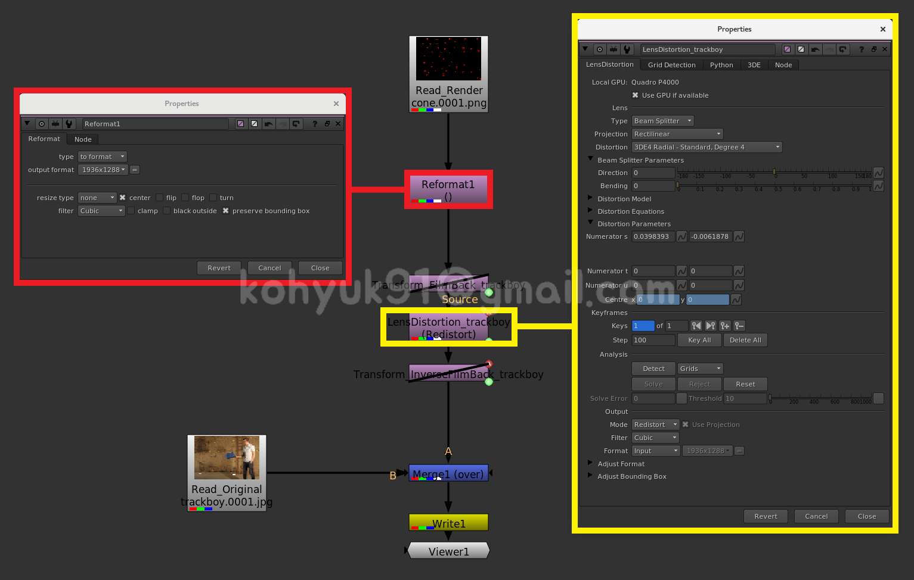<br>
    - Details
        - Reformat Node
            > <br>
            > output format <kbd>Original Plate Resolution<kbd><br>
            > resize type <kbd>none<kbd> | <kbd>X<kbd> center<br>
            > <kbd>X<kbd> preserve bounding box<br>
        - Lens Distortion Node
            > 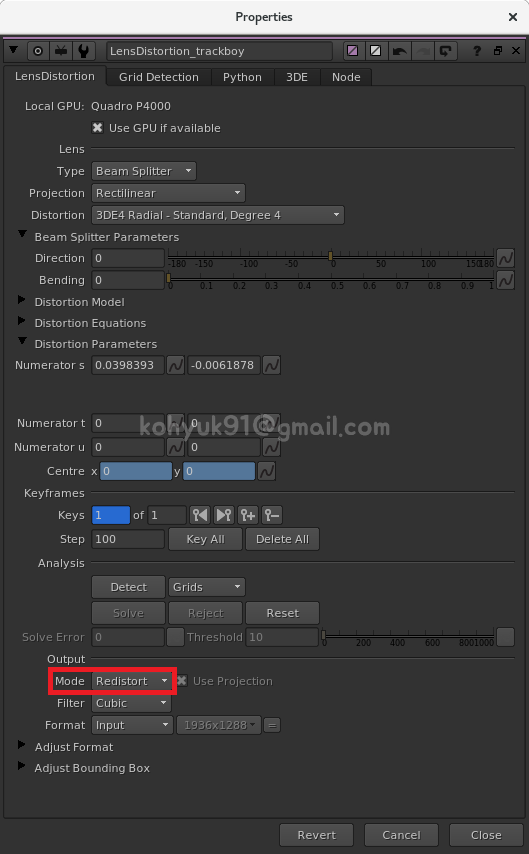<br>
            > Mode <kbd>Redistort<kbd><br>
1. Merge Render Image with "Distorted(Original)" plate
    - FINAL COMP SIZE - 1936 x 1288
    > <br>
---

### [PREV - Matchmove Software](./week2.md) &nbsp;&nbsp;&nbsp;&nbsp;&nbsp;&nbsp;&nbsp;&nbsp;&nbsp;&nbsp;&nbsp;&nbsp;&nbsp;&nbsp;&nbsp;&nbsp; [NEXT - Object Tracking](./week4.md)
