# Object Tracking

## Problem
1. 평평한 땅을 직선으로 달리는 자동차를 매치무브 하려고 한다
    >  
1. 오브젝트에만 2D Point들을 찍어서 솔브한다
    >  
    1. 오브젝트는 가만히 있고 카메라가 움직인다
        >  
    1. Point Group Type을 `Object`로 바꾼다
        >  
    1. 카메라는 가만히 있고 오브젝트가 움직인다
        >  
    - 이렇게 Point Group Type까지 바꾸었는데도 자동차는 직선으로 움직이지 않고있다. 무엇이 문제일까?
    
## Answer
- 카메라 트래킹 없이 오브젝트 트래킹만 단독으로 작업했기 때문
1. 플레이트의 내용물을 두 그룹으로 나눈다
    1. Ground >> Camera Tracking
        >  
    1. Car >> Object Tracking
        >  
1. Camera Tracking
    >  
1. Add Point Group
1. Object Tracking
    >  

## In Depth
- Tracked Camera + (Fixed Camera X Moving Object) = Object Tracking
>  
>  
>  
>  
>  

### 3DEqualizer
1. Open `mmlec/week4/3de/object_tracking_master.3de`
1. Export Moving Camera Moving Object
    - 3DE4 >> Export Project >> Maya
    - `mmlec/week4/3de/moving_camera_moving_object.mel`
1. Delete Camera Point Group
    >  
1. Solve
1. Export Fixed Camera Moving Object Scene
    1. Create Camera Point Group >> Object Point Group 단독으로 Export 하는게 불가능하다
        1. Create New Point Group
            > 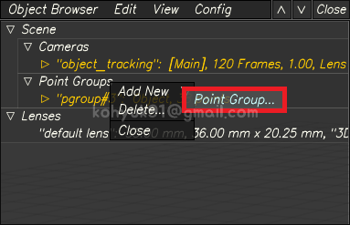 
        1. Select New Point Group
            >  
        1. Change Point Group Type to `Camera`
            > 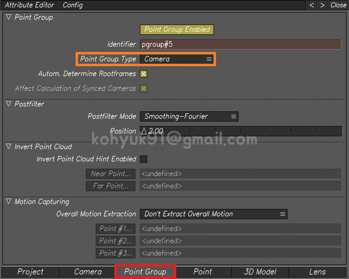 
        1. Result
            > 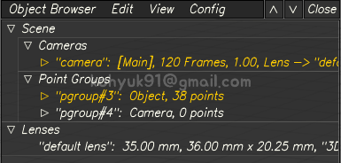 
    1. Export Project
        - 3DE4 >> Export Project >> Maya
        - `mmlec/week4/3de/fixed_camera_moving_object.mel`
### Maya
1. Import Moving Camera Moving Object
    - `mmlec/week4/3de/moving_camera_moving_object.mel`
    - Delete Object Point Group
    - Rename `Scene` to `Scene_cam`
    >  
1. Import Fixed Camera Moving Object Scene
    - `mmlec/week4/3de/fixed_camera_moving_object.mel`
    > 
1. Parent Constraint
    1. Select `Scene_cam | camera_1_1`
    1. Select `Scene`
    1. Parent Constraint Option Box
    1. Maintain offset: `OFF`
    1. Add
    >  
1. Result
   > 
   
## Object Tracking in 3DEqualizer

### Camera Tracking
- 3DE4 >> Open Project
    - `mmlec/week4/3de/trackboy_object_tracking_start.3de`
    > 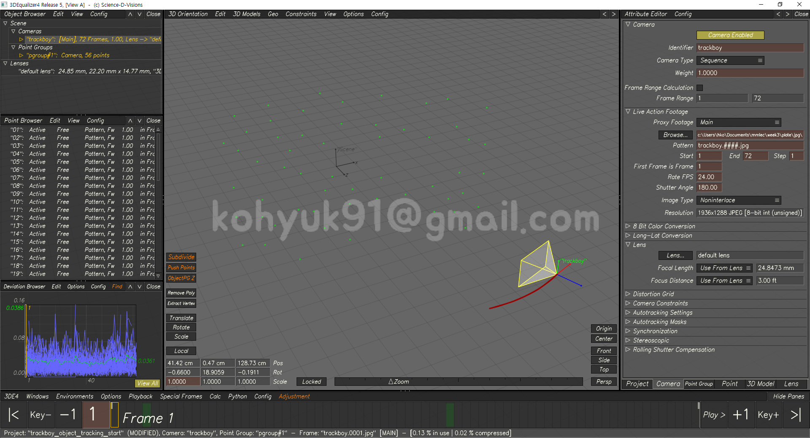
### Create Point Group
> 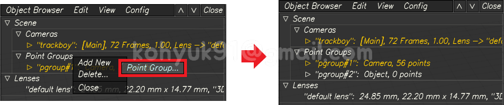
### Set Current Point Group
> 
### 2D Point Tracking
- Import 2D Tracks
    > 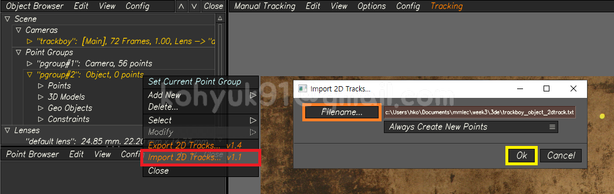 
    > 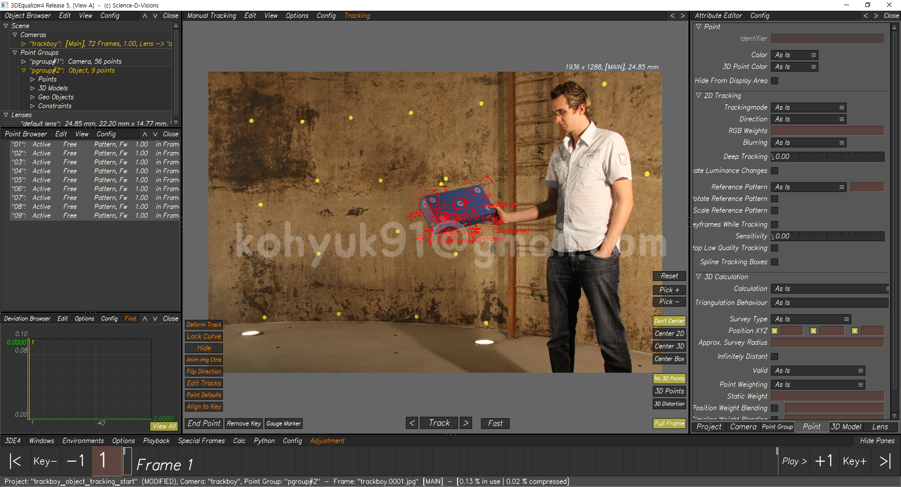 
### Solving
- Calc >> Calc All From Scratch <kbd>Alt+C</kbd>
1. Solved
    > 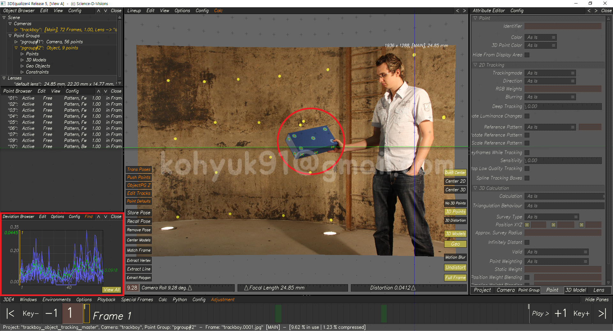 
1. Scale Issue
    > 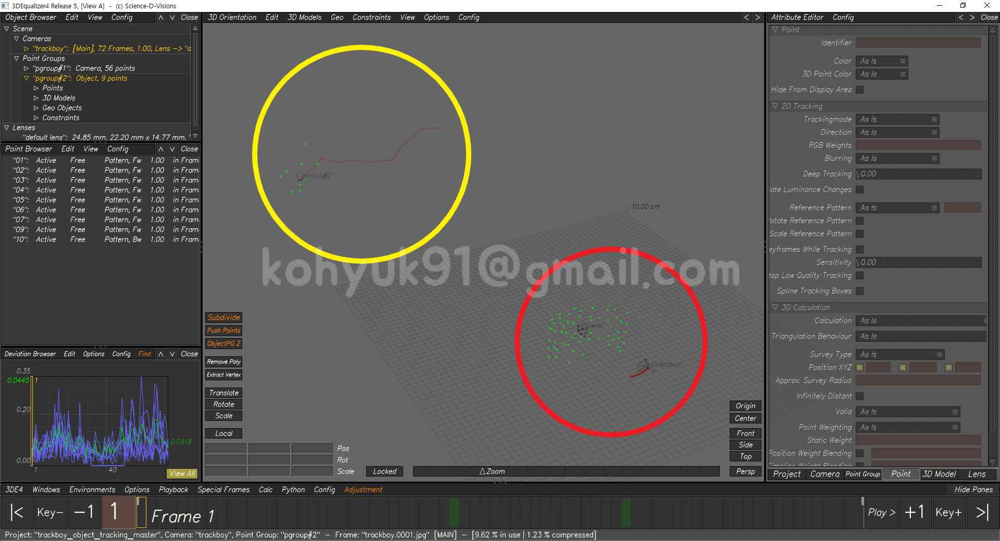 
### Fix Scale
1. Turn On Scale Manipulator
    > 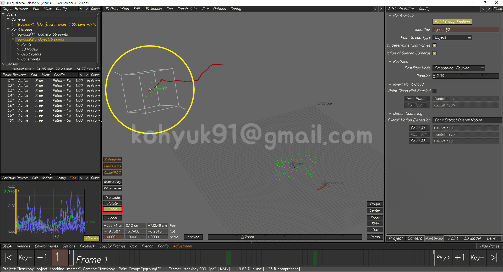 
1. Adjust Scale
    >  
1. Fixed
    - Object Point Group이 남자가 서 있는 위치 까지 올 수 있게 스케일을 조정한다.
    > 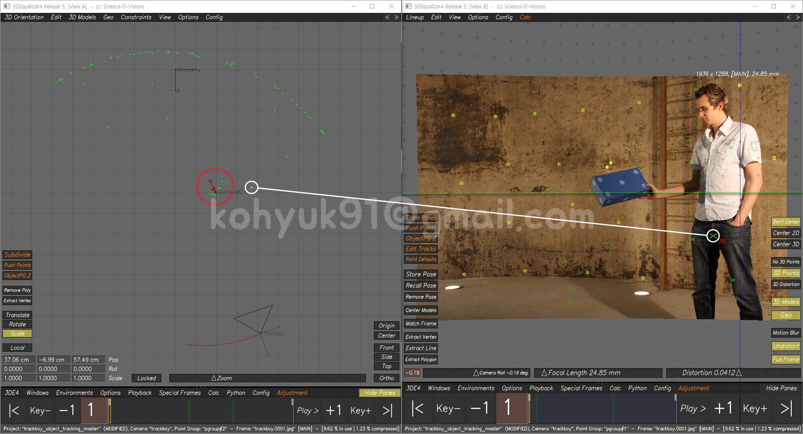 
### [Orient Scene](https://github.com/kohyuk91/mmlec/blob/master/doc/week3.md#orient-scene)
> 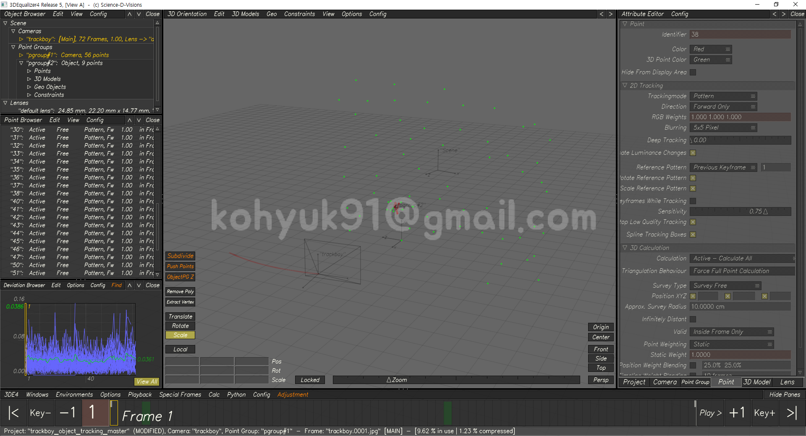 
### [Export 3DE Project to Maya](https://github.com/kohyuk91/mmlec/blob/master/doc/week3.md#export-3de-project-to-maya)

## Object Tracking in Maya

### Import 3DE Project

### Compensate for Overscan(오버스캔 상쇄)

### Set Modeling
1. 바닥 & 벽 모델링
1. 상자 모델링
- Viewport2.0 Tips
    1. Multisample anti-aliasing
    1. Holdout
### Scale Scene

### Preview
