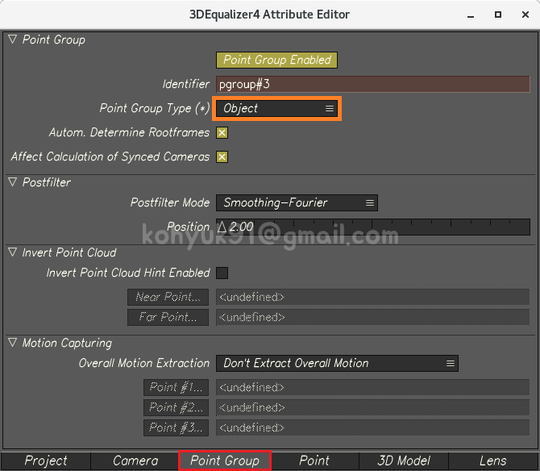

# Object Tracking

## Problem
1. 평평한 땅을 직선으로 달리는 자동차를 매치무브 하려고 한다
    >  
1. 오브젝트에만 2D Point들을 찍어서 솔브한다
    1. 오브젝트는 가만히 있고 카메라가 움직인다
        >  
    1. Point Group Type을 `Object`로 바꾼다
        >  
    1. 카메라는 가만히 있고 오브젝트가 움직인다
        >  
    - 이렇게 Point Group Type까지 바꾸었는데도 자동차는 직선으로 움직이지 않고있다. 무엇이 문제일까?
    
## Answer
- 카메라 트래킹 없이 오브젝트 트래킹만 단독으로 작업했기 때문
1. 플레이트의 내용물을 두 그룹으로 나눈다
    1. Ground >> Camera Tracking
        >  
    1. Car >> Object Tracking
        >  
1. Camera Tracking
1. Object Tracking
1. Parent Constraint

## In Depth

## Object Tracking in 3DEqualizer

- Camera Tracking

- Create Point Group

- 2D Point Tracking

- Solving

- Exporting

## Object Tracking in Maya
